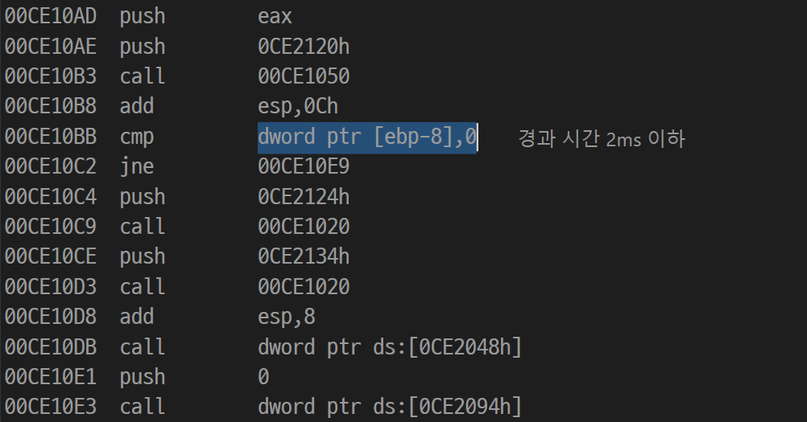
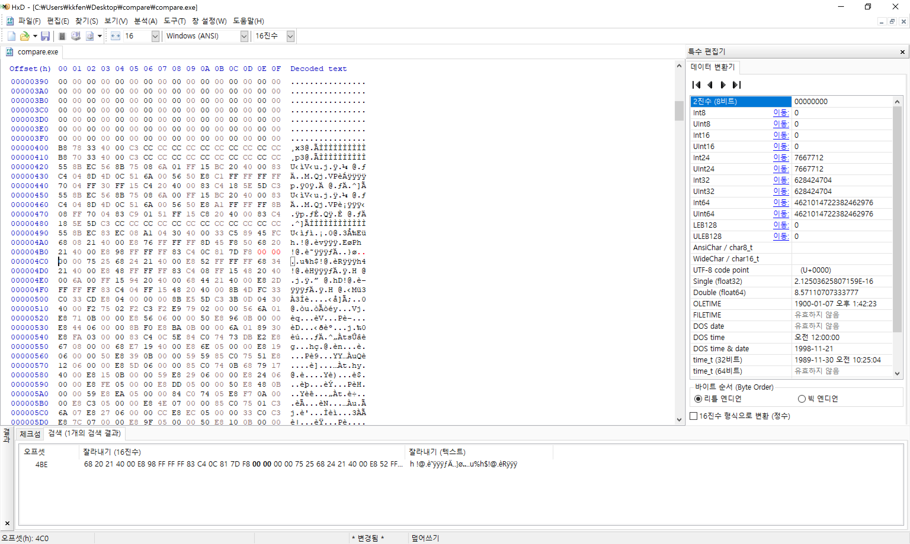
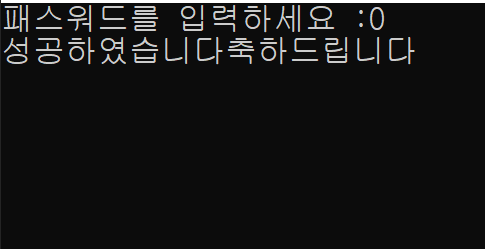
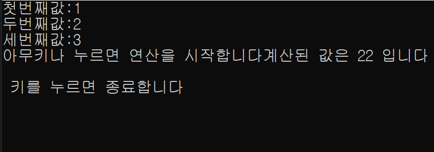
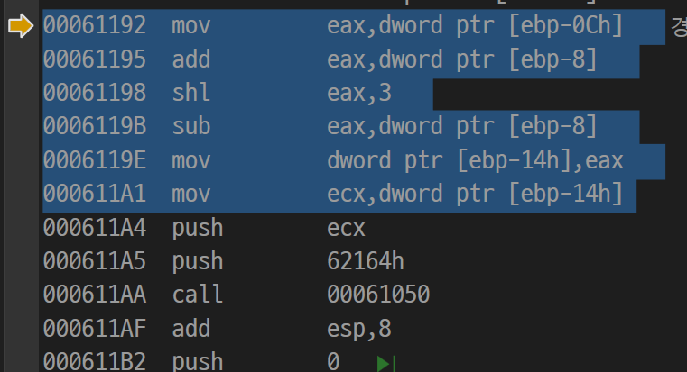
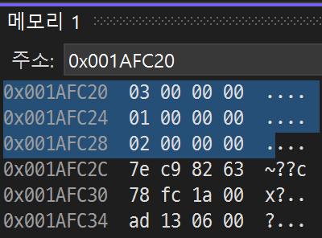

# Disassembly

## Password Cracking

특정 패스워드 숫자 값을 입력받아 지정된 값과 비교되는 프로그램이 주어진다.
1. 패스워드 값 (숫자) 를 찾아내야 한다.
2. 패스워드를 0으로 변경(크래킹)해야 한다.

프로그램을 실행하고, visual studio 디버거와 연결하여 디스어셈블리를 실행하였다. 실행 스택을 뒤져보면서 C 라이브러리 부분을 제외하고 작성된 프로그램의 코드가 실행되는 부분을 찾았고, 입력된 값 `ebp-8`과 패스워드를 비교하는 부분을 발견했다.
> 이미 해결된 이후에 캡쳐된 이미지라 위 이미지에는 0이라고 적혀 있지만, 원래는 `3564h`가 있었다.

위 16진수 값을 찾아 hex editor에서 0으로 고쳐주었다.

그 결과 0을 입력하였을 때 올바르게 동작하게 되었다.

## Operation Tracking

위와 같이 3개의 숫자를 입력하였을 때 값이 출력되는 계산 공식을 알아내야 한다.

마찬가지로 실행 스택을 찾아보다가 위와 같은 어셈블리 코드를 발견하였고, 첫 번째 입력값이 `ebp-0Ch`, 두 번쨰 입력값이 `ebp-8`, 세 번째 입력값이 `ebp-10h`에 저장되어 있음을 파악하였다.

계산 공식은 보이는대로, 첫 번째 값과 두 번째 값을 더하여 8을 곱한 후, 두 번째 값을 뺀 것이다.

세 번째 값은 계산에 사용되지 않았다.