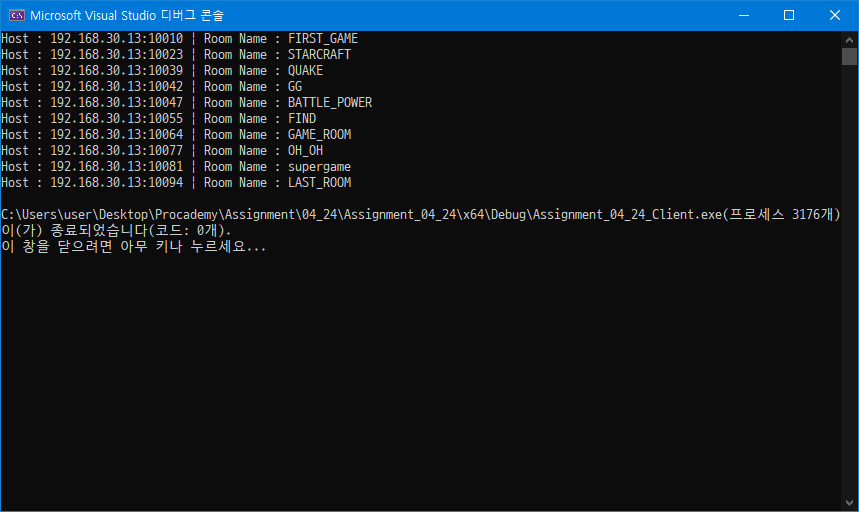

# BroadCasting

브로드캐스팅은 LAN에 연결된 모든 컴퓨터에 패킷을 전송하는 것을 의미한다.

스타크래프트 등 LAN 게임에서 방을 만들고, 다른 참가자들이 방 목록을 확인하여 같이 게임을 할 수 있는데 이 방 목록은 다음과 같은 방법으로 표시된다.

1. 방을 찾길 원하는 유저가 브로드캐스팅을 하여 방을 개설한 유저가 있는지 확인한다.
2. 방을 개설한 유저가 응답한다.
3. 방을 찾길 원하는 유저의 컴퓨터에 방을 개설한 유저들의 응답을 모아서 보여주는 것이 방 목록이다.

## 실행 결과

## Additional

* 브로드캐스팅은 UDP 프로토콜로만 동작한다.
* 방 이름이 유니코드 문자열이기 때문에 수신할 때 유의해야 한다.
* 소켓 옵션으로 타임 아웃을 설정하면 `recvfrom` 시 시간을 초과할 때 `SOCKET_ERROR(10060)`이 발생한다. 이 경우엔 continue를 하여 패스하면 된다.